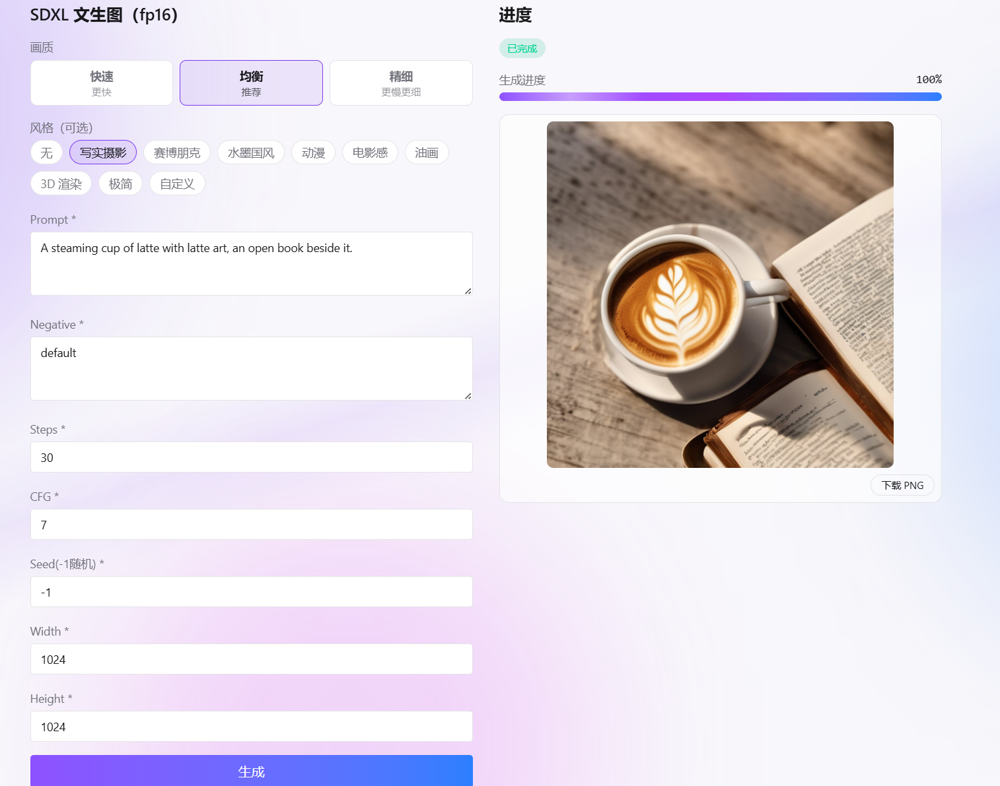
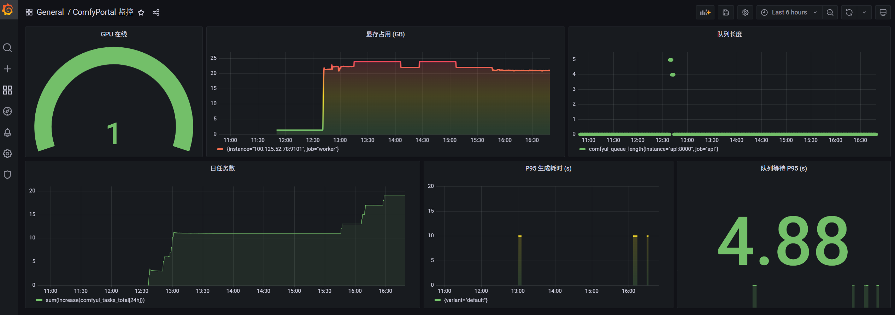
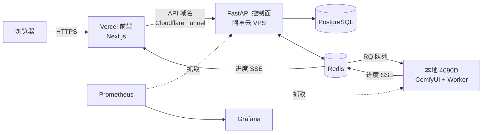

# ComfyPortal

自己电脑上一块 4090D，搭了个能多人用的 ComfyUI 出图网站。控制面挂在阿里云 VPS 上 24 小时在线，GPU 在本地跑——别人打开网页选个工作流就能排队出图，你关机了它也知道，照常收单、排队，等你开机接着跑。


## 截图

| 首页 | 生成页（参数 + 实时进度 + 结果） | 监控面板 |
|------|------|------|
|  |  |  |

## 它做了什么

说人话就是这几件事：

- **三个预置工作流**：SDXL、FLUX、SD1.5，点进去填提示词就能出图。不用懂 steps/cfg 这些——给了「快速 / 均衡 / 精细」三档画质，外加 8 种预设风格（写实、赛博朋克、水墨、动漫…）一键套。
- **多用户**：注册登录，每人每天有配额（默认 20 张），超了提示「今日配额已用完」。
- **实时进度**：提交后 SSE 推进度，能看到「排队中 · 前方 N 人」→ 进度条 → 出图。不是点完干等。
- **主机在线状态**：首页一眼看出 GPU 在不在线。电脑关机了照样能提交，任务进队列攒着。
- **画廊**：生成完的作品集中展示。
- **监控**：Prometheus + Grafana，显存占用、队列长度、P95 生成耗时、日任务数都看得见。

负面提示词里强制拼了一串违规过滤词（nudity / violence / gore 之类），用户删不掉——这是刻意的，不是 bug。

## 架构

控制面和 GPU 分开：VPS 上那部分要一直在线，本地 GPU 那台不需要。



一句话流程：前端提交 → 控制面写库 + 入队 → 本地 worker 领任务 → 调 ComfyUI 出图 → 结果压缩传回 VPS → 前端通过 SSE 一路看到进度。

本地和 VPS 之间走 Tailscale 私有网，不把 ComfyUI 暴露到公网。

## 技术栈

| 层 | 用了什么 |
|----|---------|
| 前端 | Next.js 15 (App Router) + TypeScript + Tailwind v4，部署在 Vercel |
| 控制面 | FastAPI + SQLAlchemy 2.0 + PostgreSQL，跑在 VPS 的 Docker 里 |
| 队列 / 缓存 | Redis + RQ |
| GPU 节点 | RQ SimpleWorker（Windows 上不能 fork，所以用 SimpleWorker）+ ComfyUI API |
| 认证 | JWT + bcrypt |
| 监控 | Prometheus + Grafana + node_exporter |
| 内网 / 隧道 | Tailscale + Cloudflare Tunnel |
| 契约 | packages/shared：pydantic + TypeScript 双份，接口两边共用 |

## 目录结构

```
apps/web       # Next.js 前端（页面、组件、Tailwind 主题）
apps/api       # FastAPI 控制面：认证 / 任务 / 工作流 / 画廊 / SSE / 指标
apps/worker    # RQ worker：ComfyUI client、重试、上传、心跳、显存采样
packages/shared# 任务状态机 + SSE 事件 + DTO（py/ts 双份，改接口要两边同步）
deploy/        # docker-compose、Prometheus/Grafana 配置、组网和迁移文档
scripts/       # seed 工作流、bench、loadtest、模型下载脚本
docs/          # README 用的截图
```

## 本地跑起来

```bash
# Python 侧（api / worker 各自 venv）
cd packages/shared/python && pip install -e .
cd apps/api && pip install -e .[dev]
cd apps/worker && pip install -e .[dev]

# Web 侧
npm install
npm run dev:web
```

生成得先有本地 ComfyUI 跑着，模型放到它对应的 `models/` 目录（checkpoints / unet / clip / vae）。

## 部署

VPS 上 `deploy/docker-compose.yml` 一把起 api / redis / postgres / cloudflared，监控那组（prometheus / grafana / node_exporter）用 `--profile monitoring` 单独拉。前端走 Vercel 的 Git 集成自动部署。具体见 `deploy/` 下的几个 md。

## 几个数字

- 硬件：4090D 24GB
- 模型定位：SD1.5 GGUF 最快（几秒一张，质量一般）；SDXL fp16 是 1024² 的质量基线；FLUX fp8 质量最好
- 日配额默认 20 张/人，在 `.env` 里 `DAILY_QUOTA_DEFAULT` 改
- 队列、耗时、显存这些都在 Grafana 里实时看

## 已知的坑和局限

- **中文 prompt**：SD1.5 / SDXL 的文本编码器是英文训的，中文基本听不懂；FLUX 能懂一点但不全。真正支持中文得上 Qwen-Image（todo）。
- SD1.5 出图快但糊，别拿它当质量标杆。
- RQ 在 Windows 上没有 fork，所以 worker 用的是 SimpleWorker（单进程，不是并发那套）。
- 注册是开放注册，没有邮箱验证和找回密码——个人项目够用，真上生产再补。

## 约定

- 文档写中文，代码和标识符英文；commit 走 conventional commits
- 接口变更必须同步 `packages/shared` 的 py + ts 两份
- CI（GitHub Actions）三道：api 的 pytest + ruff、worker 的 ruff、web 的 lint + test + build
