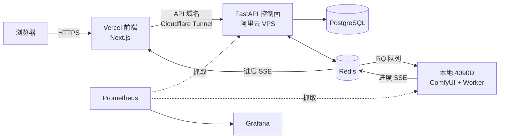

<p align="center">
  
</p>

# ComfyPortal

[English](README_EN.md)

**ComfyPortal** 是一个自托管的 ComfyUI 图像生成门户，把本地一块 4090D 的出图能力，做成一个多用户可用的 Web 服务。控制面常驻云上、24 小时在线，GPU 留在本地跑；打开网页、选个工作流、填句提示词，就能排队出图，全程实时看到进度。


## 主要功能

- **三个预置工作流**：SDXL、FLUX、SD1.5，点进去就能用。画质分「快速 / 均衡 / 精细」三档，另有 8 种预设风格（写实、赛博朋克、水墨、动漫、电影感等）一键套上，不会调参也能出图。三者定位不同：SD1.5 最快但质量一般，SDXL 是 1024² 的质量基线，FLUX 质量最好。
- **多用户 + 配额**：注册登录走 JWT，每人每天有生成额度（默认 20 张），用完提示「今日配额已用完」。
- **实时进度**：提交后 SSE 一路推状态，从「排队中 · 前方 N 人」到进度条再到出图，不是点完就干等。
- **主机状态可见**：首页直接标出 GPU 在不在线。电脑关机了，别人照样能提交，任务进队列攒着，开机接着跑。
- **画廊**：生成完的作品集中展示。
- **监控**：Prometheus + Grafana，显存占用、队列长度、P95 生成耗时、日任务数一屏看完。

生成页（参数 + 实时进度 + 结果）：


监控面板：


负面提示词里会强制拼上一串违规过滤词（nudity / violence / gore 等），这一串用户删不掉。

## 架构

控制面和 GPU 分开：云上那部分要一直在线，本地 GPU 那台不需要。



前端提交 → 控制面写库 + 入队 → 本地 worker 领任务 → 调 ComfyUI 出图 → 结果压缩传回 VPS → 前端靠 SSE 一路看到进度。本地和 VPS 之间走 Tailscale 私有网，ComfyUI 不暴露到公网。

## 技术栈

| 层 | 结构 |
|----|---------|
| 前端 | Next.js 15 (App Router) + TypeScript + Tailwind v4，部署在 Vercel |
| 控制面 | FastAPI + SQLAlchemy 2.0 + PostgreSQL，跑在 VPS 的 Docker 里 |
| 队列 / 缓存 | Redis + RQ |
| GPU 节点 | RQ SimpleWorker（Windows 不能 fork，所以用 SimpleWorker）+ ComfyUI API |
| 认证 | JWT + bcrypt |
| 监控 | Prometheus + Grafana + node_exporter |
| 内网 / 隧道 | Tailscale + Cloudflare Tunnel |
| 契约 | packages/shared：pydantic + TypeScript 双份，接口两边共用 |

## 目录结构

```
apps/web       # Next.js 前端：页面、组件、Tailwind 主题
apps/api       # FastAPI 控制面：认证 / 任务 / 工作流 / 画廊 / SSE / 指标
apps/worker    # RQ worker：ComfyUI client、重试、上传、心跳、显存采样
packages/shared# 任务状态机 + SSE 事件 + DTO（py/ts 双份，改接口要两边同步）
deploy/        # docker-compose、Prometheus/Grafana 配置、组网和迁移文档
scripts/       # seed 工作流、bench、loadtest、模型下载脚本
docs/          # README 用的截图和 logo
```

## 本地开发

```bash
# Python 侧（api / worker 各自 venv）
cd packages/shared/python && pip install -e .
cd apps/api && pip install -e .[dev]
cd apps/worker && pip install -e .[dev]

# Web 侧
npm install
npm run dev:web
```

生成需要本地 ComfyUI 跑着，模型放到它对应的 `models/` 目录（checkpoints / unet / clip / vae）。

## 部署

VPS 上 `deploy/docker-compose.yml` 一把起 api / redis / postgres / cloudflared；监控那组（prometheus / grafana / node_exporter）用 `--profile monitoring` 单独拉。前端走 Vercel 的 Git 集成自动部署。细节见 `deploy/` 下几个 md。

## 已知问题

- **中文 prompt**：SD1.5 / SDXL 的文本编码器是英文训的，中文基本听不懂；FLUX 能懂一点但不全。真正支持中文得上 Qwen-Image。
- RQ 在 Windows 没有 fork，worker 用 SimpleWorker，是单进程不是并发。
- 注册是开放注册，没邮箱验证和找回密码，个人项目够用，上生产再补。
