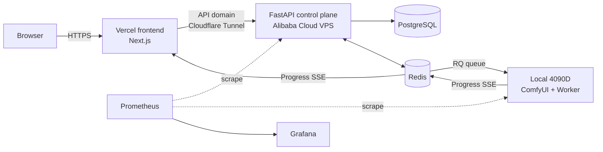

<p align="center">
  
</p>

# ComfyPortal

[中文](README.md)

**ComfyPortal** is a self-hosted ComfyUI image generation portal that turns a local RTX 4090D into a multi-user web service. The control plane runs in the cloud 24/7 while the GPU stays local — open the page, pick a workflow, type a prompt, and images generate in a queue with live progress.


## Features

- **Three preset workflows**: SDXL, FLUX, and SD1.5. Each has three quality presets (Fast / Balanced / Fine) and 8 style presets (photorealistic, cyberpunk, ink wash, anime, cinematic, and more), so you get decent results without touching steps or CFG. They target different things: SD1.5 is fastest but rough, SDXL is the 1024² baseline, FLUX has the best quality.
- **Multi-user with quotas**: JWT auth, each user gets a daily generation quota (default 20, configurable via `.env`). Hitting it shows "今日配额已用完" (daily quota exhausted).
- **Live progress**: SSE pushes status through the whole run — "queued, N ahead" → progress bar → result. No blind waiting.
- **Visible host status**: the home page shows whether the GPU is online. If the machine is off, people can still submit; jobs queue up and run once it's back.
- **Gallery**: finished work is collected in one place.
- **Monitoring**: Prometheus + Grafana cover VRAM, queue length, P95 generation time, and daily task count on one screen.

Generation page (params + live progress + result):


Monitoring dashboards:


A safety filter (nudity / violence / gore, etc.) is forcibly appended to the negative prompt and can't be removed by the user.

## Architecture

The control plane and the GPU are separated — the cloud part needs to stay online, the local GPU machine doesn't.



Flow: the frontend submits → the control plane writes to the DB and enqueues → the local worker picks up the job → calls ComfyUI → the result is compressed and uploaded back to the VPS → the frontend follows the whole thing over SSE. The local machine and VPS talk over a Tailscale private network, so ComfyUI is never exposed to the public internet.

## Tech stack

| Layer | What's used |
|-------|-------------|
| Frontend | Next.js 15 (App Router) + TypeScript + Tailwind v4, deployed on Vercel |
| Control plane | FastAPI + SQLAlchemy 2.0 + PostgreSQL, in Docker on the VPS |
| Queue / cache | Redis + RQ |
| GPU node | RQ SimpleWorker (Windows can't fork, hence SimpleWorker) + ComfyUI API |
| Auth | JWT + bcrypt |
| Monitoring | Prometheus + Grafana + node_exporter |
| Network / tunnel | Tailscale + Cloudflare Tunnel |
| Contract | packages/shared: pydantic + TypeScript in lockstep, shared by both sides |

## Project structure

```
apps/web       # Next.js frontend: pages, components, Tailwind theme
apps/api       # FastAPI control plane: auth / tasks / workflows / gallery / SSE / metrics
apps/worker    # RQ worker: ComfyUI client, retries, upload, heartbeat, VRAM sampling
packages/shared# task state machine + SSE events + DTOs (py/ts, keep both in sync)
deploy/        # docker-compose, Prometheus/Grafana configs, networking and migration docs
scripts/       # workflow seeding, bench, loadtest, model download
docs/          # screenshots and logo used by the README
```

## Local development

```bash
# Python side (separate venvs for api / worker)
cd packages/shared/python && pip install -e .
cd apps/api && pip install -e .[dev]
cd apps/worker && pip install -e .[dev]

# Web side
npm install
npm run dev:web
```

Generation requires a local ComfyUI with models placed in its `models/` directories (checkpoints / unet / clip / vae).

## Deployment

`deploy/docker-compose.yml` on the VPS brings up api / redis / postgres / cloudflared; the monitoring stack (prometheus / grafana / node_exporter) is pulled up separately with `--profile monitoring`. The frontend deploys automatically via Vercel's Git integration. See the docs under `deploy/`.

## Known issues

- **Chinese prompts**: SD1.5 / SDXL text encoders are English-trained and barely understand Chinese; FLUX gets some of it but not fully. Proper Chinese support needs Qwen-Image.
- RQ has no fork on Windows, so the worker uses SimpleWorker — single process, not concurrent.
- Registration is open, with no email verification or password reset. Fine for a personal project, would need work for production.
